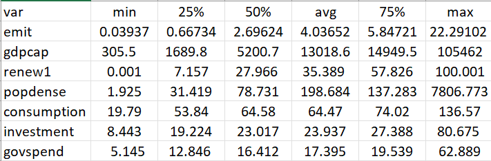

The full annotated code for this project can be found [here]().
All code was last run on R 4.3.1

# TLDR

I perform a series of statistical analyses in R to construct a multiple regression model which best predicts a country's emissions levels. 

# Introduction

Climate change is one of the most pressing issues facing the world today. Many believe that the most feasible solution to climate change is to gradually shift to renewable energy through increased investment and favorable legislation. This is the center of most Western climate strategies, but a prominent theory known as “degrowth” posits that the only way to address the root causes of climate change is to decrease economic activity and consumption (Piper, 2021). Embracing this theory would require households to radically shift their living and spending behaviors. Reusable materials and renewable energy would become vital, and populations would likely have to become denser to avoid the energy waste and pollution of urban sprawl. The theory is not politically popular, but its logic is sound: almost all emissions are related in some way to economic production, so reducing this production would necessarily decrease pollution. 

But would these changes actually reduce pollution? Using data from the World Bank, this projet attempts to determine whether or not economic activity, use of renewables, and population density have a considerable association with national C02 emissions. To extend the discussion of economic activity, this paper looks at individual major components of GDP by nation to determine which sectors of the economy bear greater responsibility for emissions. Understanding these relationships will be invaluable for effective policy making in the future.

# The data

The data are from the World Bank’s _World Development Indicators_ data set. There are 159 cases for the data, which is every country for which the World Bank has complete data for all of the variables of interest in this multiple regression analysis. To maximize the number of available countries for analysis, data from 2015 is used for all variables. Still, there are 58 countries with only partial observations. These are primarily smaller nations in the Middle East, Africa, and South America, as well as small island nations with very small populations. The variables are as follows (units in parentheses):
  - _emit_ - _C02 Emissions (metric tons per capita)_ - a measurement of the carbon emissions arising from industrial production and other activities. This measurement is used as a stand-in for overall emission levels and the broader contribution to climate change for a country.
  - _gdpcap_ - _GDP per capita (constant 2015 USD)_ - total economic output of the country divided by its population. This variable is a common measure for a country’s wealth, but is also useful in determining the level of economic activity within an economy
  - _renew1_ - _Renewable electricity output (% of total electricity output)_ - the ratio of energy generated by renewable power plants to the energy generated by all power plants in a country. renew1 is created by adding 0.001 to all realizations of the variables to allow for certain transformations (e.g. logarithmic) without affecting the data significantly.
  - _popdense_ - _Population density (people per sq. km of land area)_ - the country’s population density; quotient of population at midyear and total land area of the country.
  - _consumption_ - _Households and non-profit institutions serving households (NPISH) final consumption expenditure (% of GDP)_ - this broadly measures the market value of all final goods and services consumed by households and NPISHs in a given year, otherwise known as personal consumption expenditures. Taking these expenditures as a fraction of GDP allows easier comparisons of each components’ relative effect on emissions for a given country.
  - _investment_ - _Gross fixed capital formation (% of GDP)_ - market value of all capital equipment and infrastructure, including renovations to address depreciation.
  - _govspend_ - _General government final consumption expenditures (% of GDP)_ - market value of all final goods and services purchased by the government, including military spending and government wages.

In total, there are seven variables, all continuous, which are of interest in this analysis. Since the goal is to examine what causes differential emissions leves across countries, all models will have _emit_ as the dependent variable.

# Model construction

First, a preliminary look at the distribution of all the variables in the dataset.

