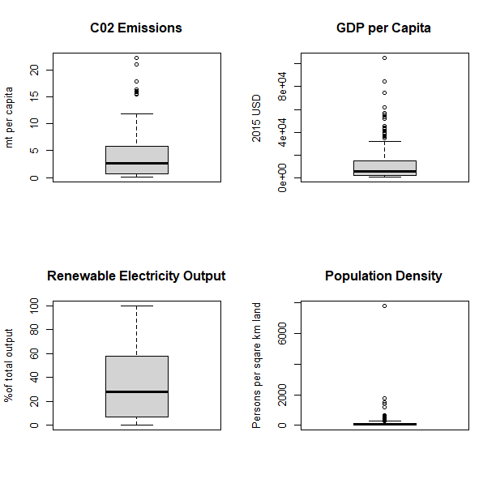
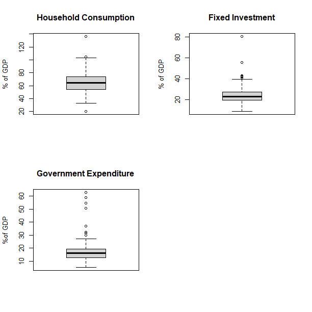
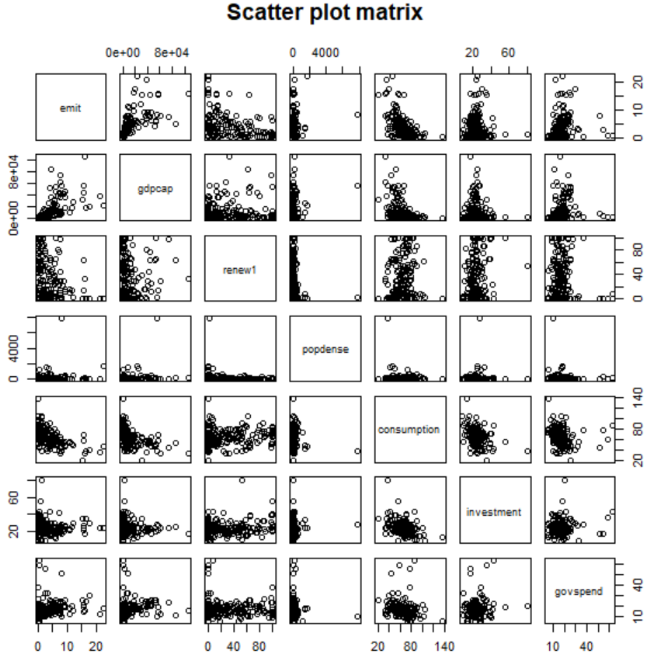
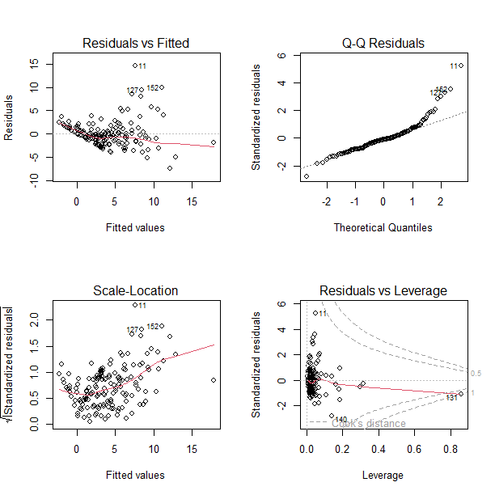
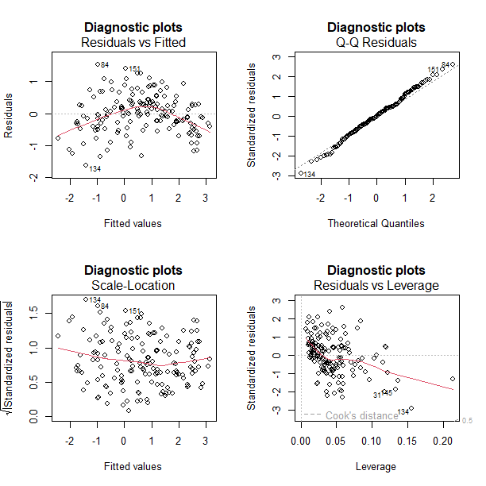
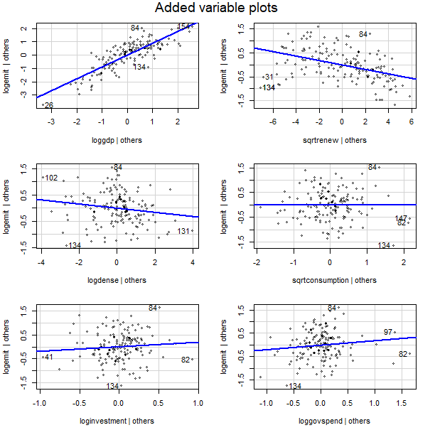
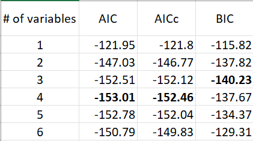
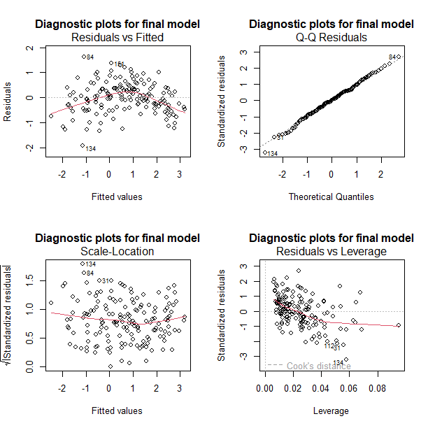
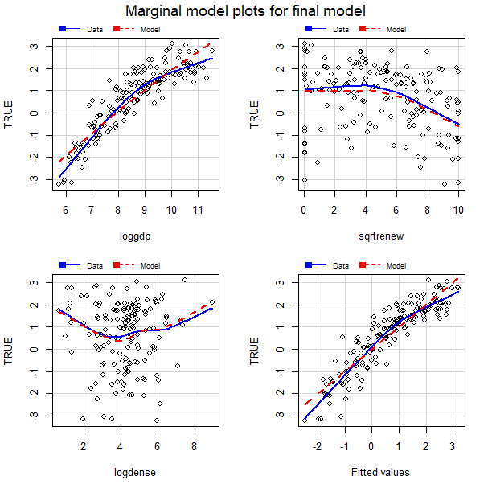

The full annotated code for this project can be found [here](https://github.com/kirin-eicher/kirin-eicher.github.io/blob/main/code/Final%20Project%20Coding.txt).

The final cleaned dataset used for this project can be found [here](https://github.com/kirin-eicher/kirin-eicher.github.io/tree/main/datasets).

All code was last run on R 4.3.1

# TLDR

I perform a series of statistical analyses in R to construct a multiple regression model which best predicts a country's emissions levels. 

# Introduction

Climate change is one of the most pressing issues facing the world today. Many believe that the most feasible solution to climate change is to gradually shift to renewable energy through increased investment and favorable legislation. This is the center of most Western climate strategies, but a prominent theory known as “degrowth” posits that the only way to address the root causes of climate change is to decrease economic activity and consumption (Piper, 2021). Embracing this theory would require households to radically shift their living and spending behaviors. Reusable materials and renewable energy would become vital, and populations would likely have to become denser to avoid the energy waste and pollution of urban sprawl. The theory is not politically popular, but its logic is sound: almost all emissions are related in some way to economic production, so reducing this production would necessarily decrease pollution. 

But would these changes actually reduce pollution? Using data from the World Bank, this projet attempts to determine whether or not economic activity, use of renewables, and population density have a considerable association with national C02 emissions. To extend the discussion of economic activity, this paper looks at individual major components of GDP by nation to determine which sectors of the economy bear greater responsibility for emissions. Understanding these relationships will be invaluable for effective policy making in the future.

# The data

The data are from the World Bank’s _World Development Indicators_ data set. There are 159 cases for the data, which is every country for which the World Bank has complete data for all of the variables of interest in this multiple regression analysis. To maximize the number of available countries for analysis, data from 2015 is used for all variables. Still, there are 58 countries with only partial observations. These are primarily smaller nations in the Middle East, Africa, and South America, as well as small island nations with very small populations. The variables are as follows (units in parentheses):
  - _emit_ - _C02 Emissions (metric tons per capita)_ - a measurement of the carbon emissions arising from industrial production and other activities. This measurement is used as a stand-in for overall emission levels and the broader contribution to climate change for a country.
  - _gdpcap_ - _GDP per capita (constant 2015 USD)_ - total economic output of the country divided by its population. This variable is a common measure for a country’s wealth, but is also useful in determining the level of economic activity within an economy
  - _renew1_ - _Renewable electricity output (% of total electricity output)_ - the ratio of energy generated by renewable power plants to the energy generated by all power plants in a country. renew1 is created by adding 0.001 to all realizations of the variables to allow for certain transformations (e.g. logarithmic) without affecting the data significantly.
  - _popdense_ - _Population density (people per sq. km of land area)_ - the country’s population density; quotient of population at midyear and total land area of the country.
  - _consumption_ - _Households and non-profit institutions serving households (NPISH) final consumption expenditure (% of GDP)_ - this broadly measures the market value of all final goods and services consumed by households and NPISHs in a given year, otherwise known as personal consumption expenditures. Taking these expenditures as a fraction of GDP allows easier comparisons of each components’ relative effect on emissions for a given country.
  - _investment_ - _Gross fixed capital formation (% of GDP)_ - market value of all capital equipment and infrastructure, including renovations to address depreciation.
  - _govspend_ - _General government final consumption expenditures (% of GDP)_ - market value of all final goods and services purchased by the government, including military spending and government wages.

In total, there are seven variables, all continuous, which are of interest in this analysis. Since the goal is to examine what causes differential emissions leves across countries, all models will have _emit_ as the dependent variable.

# Model construction

First, a preliminary look at the distribution of all the variables in the dataset.

Comparing the mean and median values for each suggests that _emit_, _gdpcap_, _renew1_, and _popdense_ are all heavily right skewed due to very large outlier values (e.g. Singapore's population density is more than 4 times greater than that of the next densest country). The variables _consumption_, _investment_, and _govspend_ are also right skewed but to a lesser degree. Boxplots of the variables will help to confirm this skewness.

The boxplots show that all the variables mentioned above are right-skewed to varying degrees. Logarithmic or square root transformations may help to reduce the influence of outlier values.

A scatterplot matrix allows us to spot any clear patterns in the relationships between the variables:

GDP per capita appears to have a positive linear relationship with emissions but nonconstant variance, while the relationships between C02 and both renewable energy usage and consumption are negative. For the other variables, the scatter plots indicate no clear pattern with emissions, although large outliers and the tightly clustered distribution of the rest of the data make this assessment difficult. Selection of the final model should thus consider variable transformation and variable selection.

To be certain, let's first analyze the untransformed model with all variables indcluded as predictors:

The standardized residual plots suggest that the necessary assumptions of non-constant variance and linearity are violated. Variable transformations and selection will both be necessary to create an effective model.

To decide the appropriate transformation for each variable, I use the Box-Cox method, with _emit_ being transformed last using an inverse-repsonse plot. To simplify the interpretation of the model, I stick to log and sqaure root transformations, which luckily seem to provide a decent fit of the model with very high explanatory power ($R^2 = 0.832$). The full transformed model is 

$$\hat{log(emit_{i})} = -7.22 + 0.89log(gdp_{i}) - 0.09renew1_{i}^{1/2} - 0.08log(popdense_{i}) - 0.004consumption_{i}^{1/2} + 0.19log(investment_{i}) + 0.2log(govspend_{i})$$ 

Other transformations offer slightly higher $R^2$ values, but this model will be significantly easier to interpret. See the code for a more thorough analysis.

The transformations have removed much of the pattern from the standardized residual plot, although linearity assumption may still be broken (pattern in first graph).

Proceeding with this model, variable selection can help to improve the fit. Only the intercept and the OLS coefficients on the first three variables are significant at the 5% level. The added variable plots below show that the transformed _consumption_, _investment_, and _govspend_ variables are not useful predictors (i.e. they are individually not strongly correlated with emissions, holding other predictors constant).

We can also use Bayesian and Akaike information criterion to determine the optimal subset of predictors for the model. The tabel above shows the AIC, corrected AIC, and BIC for models using different subsets of the 6 predictors. The BIC recommends a three-variable model, while the AIC and AICc suggest four-variable models with only marginally lower criteria than values for the three-variable. Considering the AIC penalty for including more variables is smaller than the BIC, the three variable model is chosen to avoid overfitting the data.

The final model becomes 

$$\hat{log(emit_{i})} = -6.206 + 0.903log(gdp_i) - 0.095renew1_i^{1/2} - 0.1log(popdense_i)$$

The diagnositc plots are similar to the previous set, suggesting the removed variables were indeed superfluous. The marginal model plots above further confirm that the transformations were a good choice to address the skewed distribution of the predictors. Overall, this model seems valid for prediction!

# Where there's smoke, there's fire

Now we can use the coefficients from the model to understand the relationship bewteen emissions and these variables. On average, and holding other variables constant:
  - A 1% increase in GDP per capita is associated with a 0.903% increase in metric tons of C02 emissions per capita
  - A 1% increase in population density is associated with a 0.1% decrease in metric tons of C02 emissions per capita.
  - An increase in renewable energy's share in a country's energy mix is associated with a significant decrease in emissions.

These findings coincide nicely with our common sense about emissions, economic activity, and renewable energy. The model suggests with high significance that, all else equal, increasing economic activity will lead to higher emissions. However, the insignificance of consumption, investment, and government spending as individual components suggests that, when it comes to emissions, it doesn't matter where in the economy the increased activity is coming from. There is significant evidence that increasing the share of renewable electricity in the energy mix will reduce a country’s emissions. Similarly, creating denser living arrangements will also lead to decreased national C02 pollution. 

The data offer promising conclusions for proponents of the degrowth theory. Higher GDP per capita is associated with higher pollution, suggesting that lowering economic output would lessen emissions. Increasing population density, which allows for resources to be more easily shared by households, could also help to reduce a nation’s carbon footprint. Investment into renewable energy is also effective for tackling climate change at the national level. Effective climate policies could pair these initiatives together to combat C02 emissions.

# Citations

> World Bank (2022). _World Development Indicators_ [Data set]. https://databank.worldbank.org/source/world-development-indicators#

> Piper, K. (2021, August 3). Can we save the planet by shrinking the economy? _Vox_. https://www.vox.com/future-perfect/22408556/save-planet-shrink-economy-degrowth
